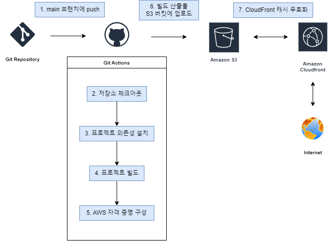
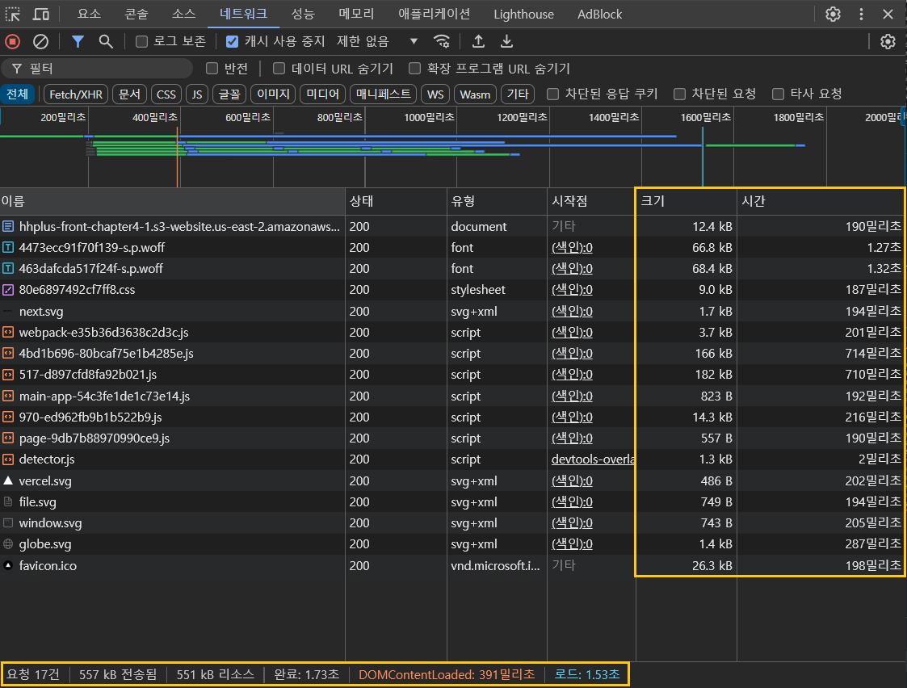
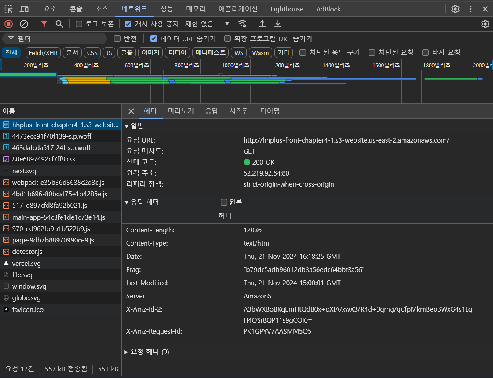
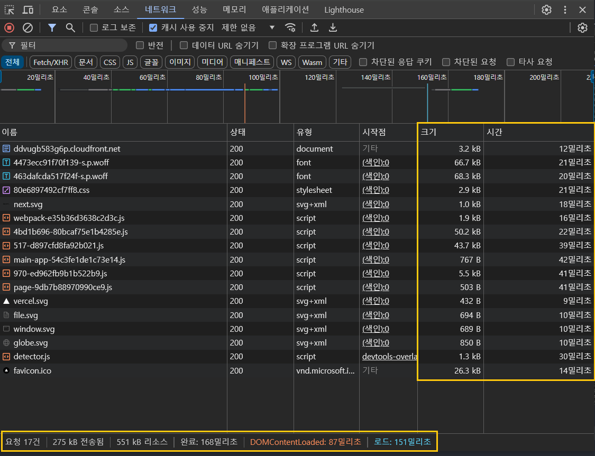
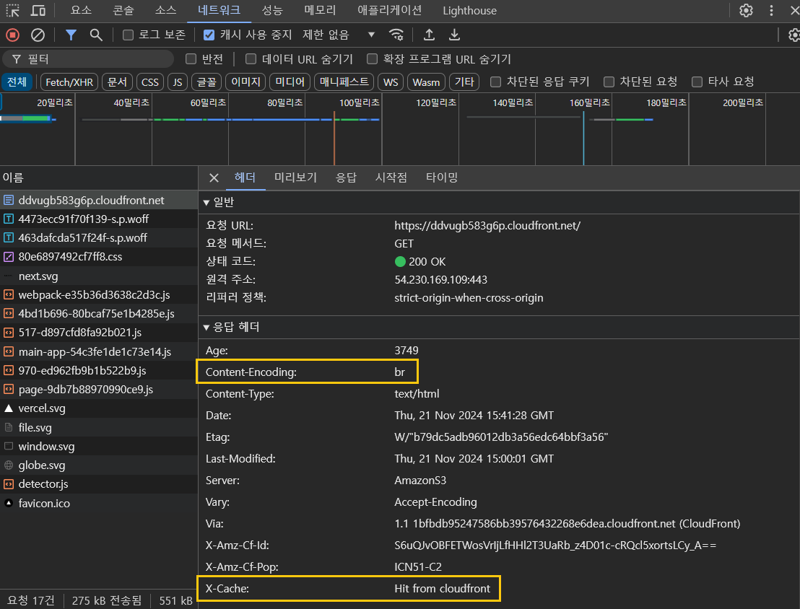

# Chapter 4-1 성능 최적화

## 프로젝트 목적

- github actions CI/CD 파이프라인 구축
- AWS CloudFront를 이용한 성능 최적화

 

## 주요 링크

-  [S3 버킷 웹사이트 엔드포인트](http://hhplus-front-chapter4-1.s3-website.us-east-2.amazonaws.com/)

- [CloudFrount 배포 도메인](https://ddvugb583g6p.cloudfront.net/)

 

## AWS 인프라 연동을 위한 Repository Secrets 설정

- `AWS_ACCESS_KEY_ID`: IAM 계정 생성시 발급받은 액세스 키
- `AWS_SECRET_ACCESS_KEY`:  IAM 계정 생성시 발급받은 비밀 액세스 키
- `AWS_REGION`: S3를 세팅한 리전(지역)의 코드
- `S3_BUCKET_NAME`: 빌드 산출물을 업로드할 S3 버킷 이름
- `CLOUDFRONT_DISTRIBUTION_ID`: S3와 연결된 CloudFront 배포 ID

 

## CI/CD 파이프라인

 

1. main 브랜치에 push하면 배포 workflow가 실행됩니다.

2. 먼저 저장소를 체크아웃합니다.

3. 노드 버전을 설정합니다.

4. 프로젝트의 의존성을 설치합니다.

5. Next.js 프로젝트를 빌드합니다. 결과물은 out/ 디렉토리에 생성됩니다.

6. AWS 자격 증명을 구성합니다.

7. 빌드된 파일을 S3 버킷에 업로드합니다.
`--delete` 옵션을 통해서 로컬에는 없지만 S3 버킷에는 있는 파일을 삭제합니다.

8. CloudFront 캐시를 무효화합니다.

 

## 주요 개념

### 1. GitHub Actions과 CI/CD 도구

#### **CI(지속적 통합)**

- 새로운 변경 사항이 정기적으로 빌드 및 테스트되어 공유 레포지토리에 통합되는 프로세스를 말합니다.
- 자동화된 빌드, 테스트(유닛, 통합 테스트), 린트, 정적 분석을 통해 변경 사항을 검증하고 피드백을 얻을 수 있습니다.

#### **CD(Continuos Delivery(지속적 제공))**

- `CI`를 통해 검증된 코드를 공유 레포지토리로 릴리스하는 과정을 자동화합니다.
- 지속적 배포와 다르게 실제로 배포는 이루어지지 않고, 프로덕션 환경으로 배포할 준비가 되어 있는 코드를 갖추는 것을 목표로 합니다.

#### **CD(Continuos Deployment(지속적 배포))**

- 프로젝트를 빌드하고, 자동으로 프로덕션 환경에 배포합니다.

#### **CI/CD**

- 이렇게 브랜치에 변경사항이 생겼을 때 테스트/빌드/배포하는 과정을 합쳐서 CI/CD 파이프라인이라고 부릅니다.
- CI/CD를 통해 자동화된 프로세스를 구축하면 개발 생산성을 향상하고, 안정적인 배포 환경을 구성할 수 있습니다.

#### **GitHub Actions**

- `push`, `pull request`와 같이 특정 트리거가 발생했을 때 워크플로를 실행시키는 자동화 도구입니다.
- `GitHub Actions`을 이용해 자동화된 CI/CD 파이프라인을 구축할 수 있습니다.
- 다른 오픈소스 CI/CD 툴로는 `Jenkins`, `CircleCI`, `GitLab CI`가 있습니다.

### 2. S3와 스토리지

#### **S3(AWS Simple Storage Service)**

- AWS에서 제공하는 클라우드 기반의 객체 스토리지 서비스이다.
- 객체 : S3에 저장되는 데이터(파일) 하나 하나를 의미한다.
- 버킷 : 객체가 저장되는 컨테이너(디렉토리)를 의미한다. 버킷 별로 지역(region)을 지정할 수 있다.
- 이번 과제에서는 Next.js 프로젝트를 `build`한 결과물을 버킷에 저장하고, 정적 호스팅하는 데 사용했다.

#### **스토리지**

- 데이터를 저장할 수 있는 장소 또는 장치를 의미한다.
- 클라우드 스토리지는 인터넷을 통해 데이터를 저장할 수 있는 시스템을 의미한다.

### 3. CloudFront와 CDN

#### **CloudFront**

- AWS에서 제공하는 CDN 서비스입니다

#### **CDN(Content Delivery Network)**

- 전 세계에 분산된 서버에 원본 서버의 데이터를 캐싱하고, 사용자에게 컨텐츠를 더 빠르게 제공하는 시스템을 말합니다.
- 각 지역에 분산 배치된 서버는 "엣지 로케이션"이라고 부릅니다. 각 "엣지 로케이션"에 원본 서버의 컨텐츠가 캐싱됩니다.

### 4. 캐시 무효화

엣지 로케이션의 캐시를 삭제하는 프로세스를 의미합니다. 
CDN은 원본 서버보다 최종 사용자에게 더 가까운 엣지 로케이션에 컨텐츠를 캐싱합니다. 
(별도의 설정이 없을 경우 TTL이 24시간으로 설정됩니다.)

캐시가 만료되기 전에 원본 서버의 파일이 변경되었을 경우, 엣지 로케이션이 기존에 캐싱된 파일을 사용하지 않고, 새롭게 변경된 파일을 요청할 수 있도록 캐시를 삭제하는 작업이 필요합니다. 
CloudFront에서는 캐시 무효화를 통해 엣지 로케이션의 캐시를 삭제할 수 있고, 
사용자는 원본 서버의 변경된 파일을 사용할 수 있습니다.

### 5. Repository secret과 환경변수

#### **Repository secret**

- api 키, password와 같이 보안에 민감한 데이터를 워크플로에서 접근하기 위해 제공되는 기능입니다.
- github에서 암호화되어 저장되며, 워크플로에서 `${{ secrets.SECRET_NAME }}`와 같이 접근할 수 있습니다.

#### **환경변수**

- 워크플로에서 사용되는 일반적인 설정 값과 옵션을 지정하는 데 사용되는 변수입니다.
- secret과 달리 워크플로 파일에서 변수를 직접 선언할 수 있습니다.

 

## CDN과 성능 최적화

### S3

|S3 요청 결과|S3 응답 헤더|
|---|---|
|||

### CloudFront

|CloudFront 요청 결과|CloudFront|
|---|---|
|||

### 성능 개선 보고서

#### 주요 성능 지표 비교

|지표|S3|CloudFront|개선율|
|---|---|---|---|
|전송된 리소스 크기|557kb|275kb|51%|
|DOMContentLoaded|391ms|87ms|78%|
|로드 시간|1.53s|151ms|90%|

### 결론

- 파일 압축을 통해 전송되는 데이터(리소스) 크기가 감소했습니다.
- 데이터 캐싱과 엣지 로케이션 활용을 통해 로드 시간과 DOMContentLoaded 시간이 개선됐습니다.
- CDN을 통해 페이지 로딩 시간을 개선할 수 있으며, 사용자 경험을 향상하는 데 기여할 수 있을 것으로 예상됩니다.
- 이 외에도, CDN을 사용할 경우 트래픽을 분산시켜 원본 서버의 부담을 줄일 수 있다는 장점이 있습니다.

 

## 참고

- https://www.redhat.com/ko/topics/devops/what-is-ci-cd
- https://www.cloudflare.com/ko-kr/learning/cdn/what-is-caching/
- https://www.cloudflare.com/ko-kr/learning/cdn/what-is-a-cdn/
- https://kiwinam.com/posts/42/remove-cache-cloud-front/
