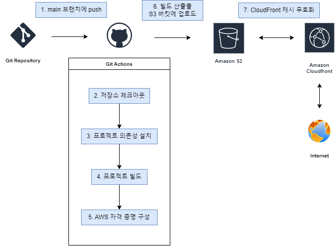

# front_3rd_chapter4-1

## 프론트엔드 배포 파이프라인

### 개요

1. main 브랜치에 push하면 배포 workflow가 실행됩니다.

2. 먼저 저장소를 체크아웃합니다.

3. 프로젝트의 의존성을 설치합니다.

4. Next.js 프로젝트를 빌드합니다. 결과물은 out/ 디렉토리에 생성됩니다.

5. AWS 자격 증명을 구성합니다.

6. 빌드된 파일을 S3 버킷에 업로드합니다.
`--delete` 옵션을 통해서 로컬에는 없지만 S3 버킷에는 있는 파일을 삭제합니다.

7. CloudFront 캐시를 무효화합니다.

### 주요 링크

- S3 버킷 웹사이트 엔드포인트: http://hhplus-front-chapter4-1.s3-website.us-east-2.amazonaws.com/
- CloudFrount 배포 도메인 이름: https://ddvugb583g6p.cloudfront.net/

### 주요 개념

- GitHub Actions과 CI/CD 도구: 
- S3와 스토리지: 
- CloudFront와 CDN: 
- 캐시 무효화(Cache Invalidation): 
- Repository secret과 환경변수: 
